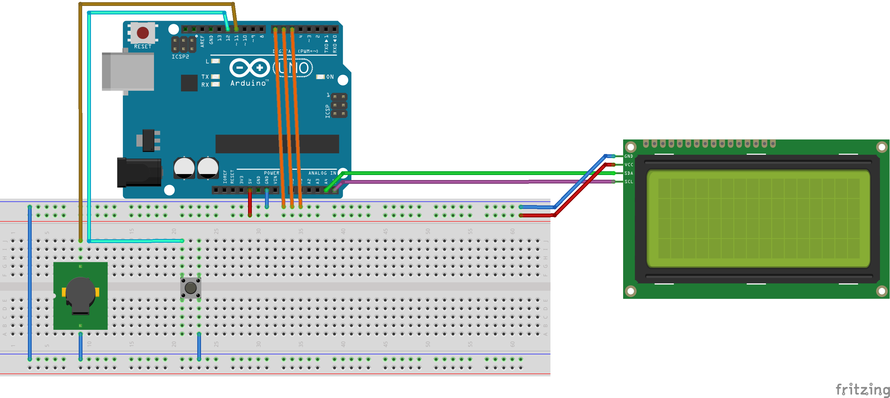

# BikeGuard
Arduino-based bike security system.

## Hardware
The system should have a battery, an Arduino board like Arduino Nano or MKR, which is both cheap and stealth, a few probe wires with fuse to protect the Arduino board, a sounding alarm, and preferably a BLE, GPS and 4G shield (not implemented yet due to lack of hardware). These probe wires can run through anywhere you want, e.g. front and rear wheel, bike seat, etc. The Arduino is designed to be installed on the bike frame in a weather and tamper-proof box. 

## Software 
In normal mode, the board actively pooling for the presence of the probe pins. If one or more probe wires is out for over 2 seconds, the alarm will be activated, and the state of alarm will be written to non-volatile memory in case of loss of power.

In alarm mode, an auditory alarm will sound, and detailed alarm information will be printed to the LCD, including when and which part of the bike has lost. If GPS and 4G module is present, the location of the bike and the alarm will be sent via Internet or text message.

## Prototype and Reality
Thanks to the never-ending pandemic, sourcing suitable and reasonably priced parts has never been harder than before. So the prototype here can't do much other than it's base functionality.

## Prototype Usage 
- Modify compile-time configuration at the beginning of `BikeGuard.ino`. 

    The `probePinouts` and the `probePinsDescription` array have the same length and one-to-one correspondence. For example, `probePinouts[0] = 5` and `probePinsDescription[0] = "Seat"` means the probe wire for the bike seat is assigned to pin 5. The alarm will be activated once it's been removed from the bike. 

- Assemble the board with an LCD screen, buzzer, re-initiate button, and probe wires.
    

- Upload the program to Arduino.

## Prototype Demo

<iframe src="https://onedrive.live.com/embed?cid=F2989B4C353D08C4&resid=F2989B4C353D08C4%21737649&authkey=AI5x4_9i_oGFaPQ" width="320" height="181" frameborder="0" scrolling="no" allowfullscreen></iframe>

Before the first boot, make sure the probe wires (orange wires above) are properly connected, then boot the Arduino up by plugging in power. The LCD screen should be showing "System normal." after a few seconds.

Try pull one of the probe wire and quickly put it back, nothing should happen because the prototype have a poor connection tolerance of 2 seconds.

Try pull one of the probe wire and wait for a few seconds, the buzzer should start buzzing non-stop and the LCD screen should say "Something has been stolen sometime ago!". The time should be incrementing and updating by itself every second. 

Try the above with other probe wires. The LCD screen should be alternating between different probe wires and their respecting time of accident.

Try plugging the wires back, the alarm won't be stopped in this way because it's programmed to be remember.

Try pulling the power of the Arduino board, obviously the alarm should stop because there is no power. But as soon as the power is back, the alarm (including the time counter) will continue, thanks to EEPROM that recorded the information on the activation of alarm. 

To completely "reset" the prototype, hold the reinitialization switch, then press the reset button on the Arduino board. Release the reinitialization switch once "System Normal" is displayed on the LCD.